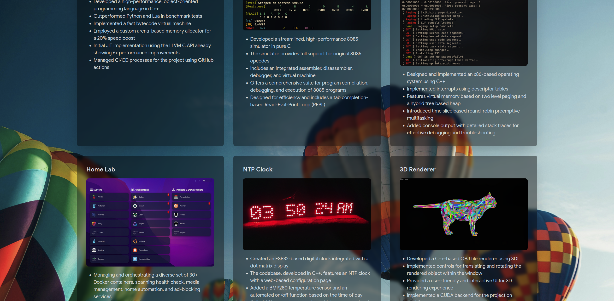
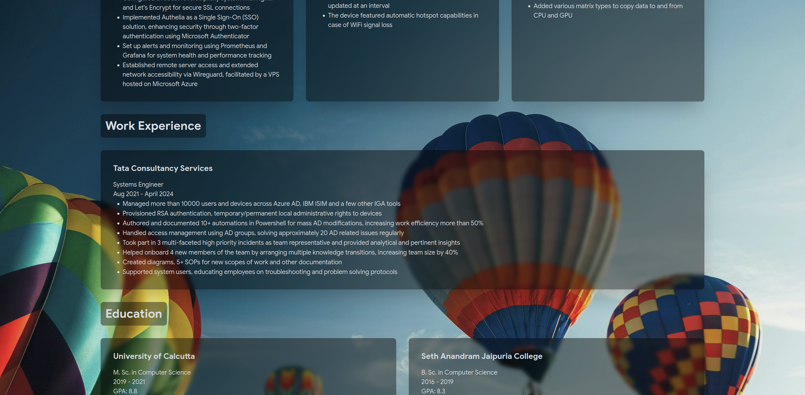
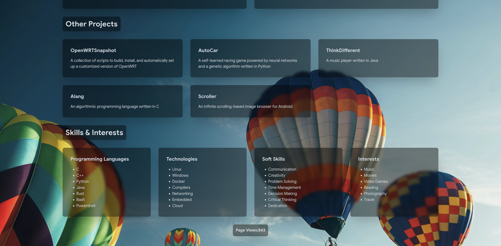

# Frontend for my CV website

Visit cv.subhranilmukherjee.com.

This can be customized for use by anyone just by modifying [projects.js](./src/projects.js) 
and [userdetails.js](./src/userdetails.js). [index.html](./src/index.html) is generated 
at runtime based on project and user details.

This repo also contains a GitHub action([resume.yml](./.github/workflows/resume.yml)) to compile 
and generate a LaTeX PDF from those details, and publish a new release.

Finally, there's another action ([deploy.yml](./.github/workflows/deploy.yml)) to automatically 
deploy [index.html](./src/index.html) as an Azure static website on each commit.

Currently my CV website looks like the following:

